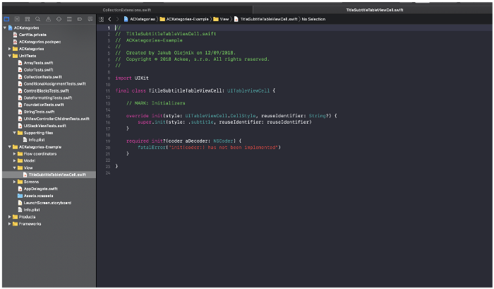
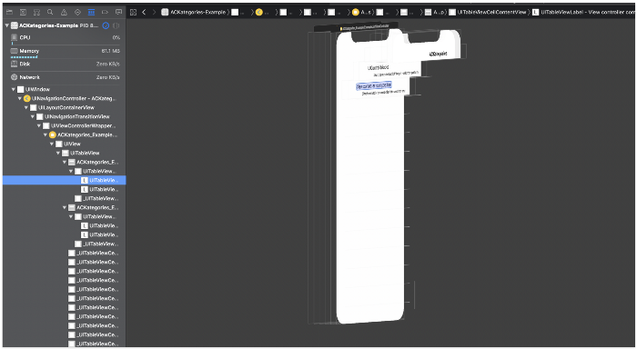
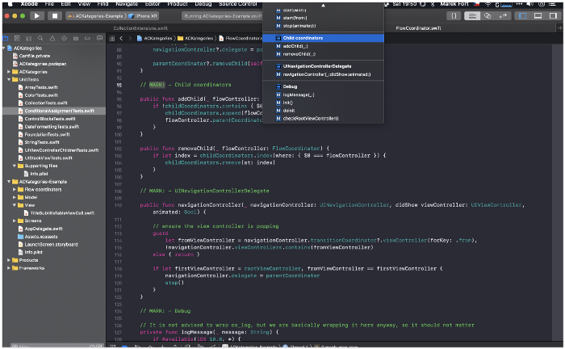
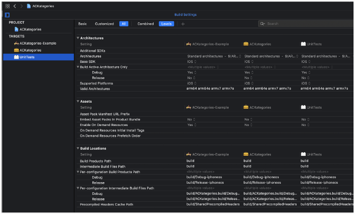

Recently, I have been seeing a lot of new tips regarding Xcode and even though I spend way too much time in it, there is still a lot I can explore. And as we all know sharing is caring ❤️, and therefore I decided to publish this article. Hopefully, you will find some of these tips useful! 😉

⌘ = Command | ⌥ = Option/Alt | ⇧ = Shift | ⌃ = Control

## Tip Number One: Current File 
So, you probably know how to quickly open a file - ⌘+⇧+O. This is obviously super useful and I can not imagine navigating in Xcode without it. But let's say I want to go to the file's location in the Project navigator - for example I want to move it somewhere else, I want to create another file in the same group (I usually use it for this one), or I just want to see the files around it. Although this is not something you need to do all the time, when you do, it is really clumsy, time-consuming and tedious to do so. And we don't want that! So to quickly see the file in the Project navigation, hit ⌘+⇧+J and you are done!

## Tip Number Two: Current View
This shortcut is quite similar to the previous one, but it is used in the view debugger. So let's say you start a view debugger and you'd like to know where exactly in the view's hierarchy the currently highlighted view is or what its constraints are. And since views in the view debugger are just named by its main class (eg. UIButton), it is really not easy to find it. Xcode shortcuts to the rescue! Just click the view your heart desires and hit ⌘+⇧+D. Easy!

## Tip Number Three: Document Items
So we've nailed navigating in the Project navigator and view debugger, what's next? How about navigating in a single file. While usually you should strive to never have huge files, sometimes it still might be beneficial to get a quick overview of all the functions and MARKs (ie Document Items). Just hit ^+6 and a scrollview appears. And what's even better is that you can right start to type to search for whatever you want! (another plus of using MARKs in your code).

## Tip Number Four: Opening Xcode project
You're in a Terminal and you want to open the Xcode project in your current directory. Well, you just type the beginning of the name of the project and let the autocompletion do the work, right? Umm, usually that's not the case. It is very common to have in the project's root directory also a subdirectory with the same name and the situation gets even worse when you use workspace. It is a lot of typing to achieve such a simple result. You just want to open your Xcode project, right? Instead of this small battle with your terminal do:
`xed .`
…and it automatically opens your project - either .xcodeproj, or if you use workspace, it automatically chooses that.

## Tip Number Five: Comparing Targets
This final tip is something you will not use very often, but when you do, it can save lives! Comparing things for a human brain is not an easy task when it does not see things exactly side-by-side. That is true in real life and in programming - and especially true when you want to compare Build Settings of your project's target. A long list of values and now try to find an outlier that makes your app sad 😞. But Xcode has a hidden gem for us - go to one of the target's Build Settings, hold ⇧ and click on the other target that you want to compare with. Then choose the type Levels and you can see nicely both target's Build Settings, just the way we wanted!
Comparing multiple targets (Levels selected)There is still so much left for me to discover about Xcode, it is not by all means perfect, but when you get used to these kinds of shortcuts and flows, it can make your life a whole lot easier. Let me know if there are tips that you find extremely useful, I'd love to know! Thanks for reading and happy coding 👨‍💻👩‍💻

